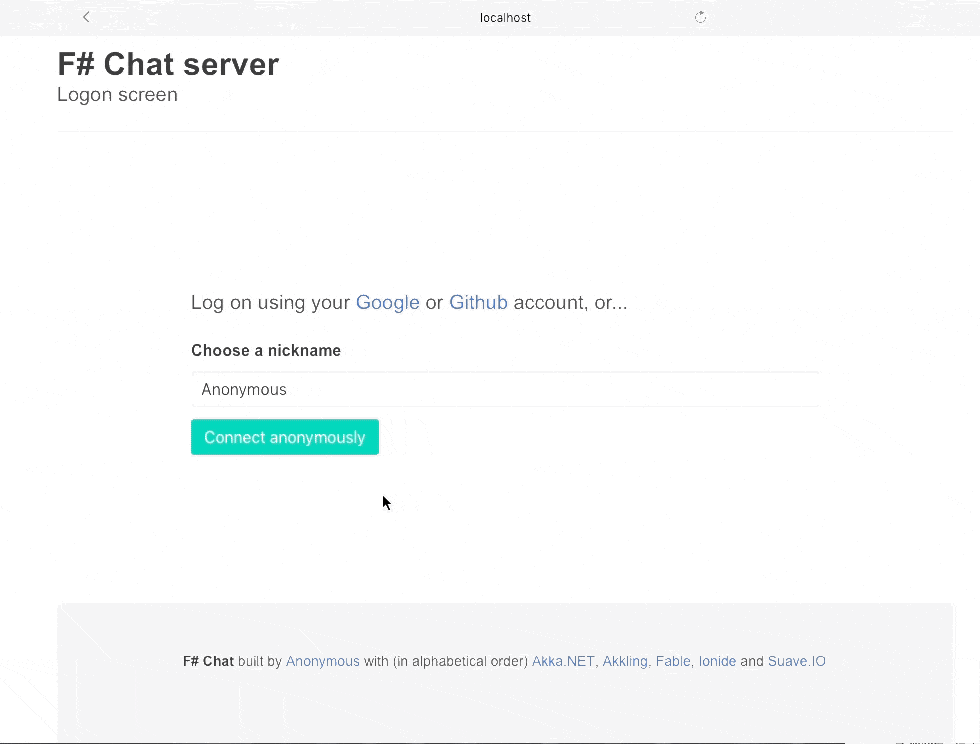

# SAFE-Chat (F#Chat)

A sample chat application built with .NET 8, F#, Akka.NET, and Fable.

## Requirements

* [.NET 8 SDK](https://dotnet.microsoft.com/download/dotnet/8.0) or higher
* [Node.js](https://nodejs.org) 22 or higher (works fine on version 8 as well)
* npm (comes with Node.js)
* Global Fable CLI: `dotnet tool install fable --global`

## Building and running the app

* Restore dependencies and build the application: `./build.sh`
* Run the application: `./build.sh start`

More commands:

* `./build.sh clean;build`
* `./build.sh build restore`
* `./build.sh build` -- build only, no restore

Alternatively, follow the instructions below:

* **Change current folder to `src/Client` folder**: `cd src/Client`
* Install JS dependencies: `yarn`
* Build client bundle: `yarn build`
* **Change directory to `src/Server` folder**: `cd ..\Server`
* Install F# dependencies: `dotnet restore`
* Run the server: `dotnet run`
* Navigate your browser to `http://localhost:8083/`

### Option 2: Modernized Client
* **Use modern build script**: `build-ox.cmd` (Windows) or equivalent bash script
* Or manually:
  * **Move to `src/Client` folder**: `cd src/Client`
  * Install dependencies: `yarn`
  * Build bundle: `yarn build`
  * **Move to `src/Server` folder**: `cd ../Server`
  * Run the server: `dotnet run`

## Developing the app

* Start the server by running `dotnet run` in the `src/Server` folder
* Navigate to the `src/Client` folder
* Start Fable daemon and dev server: `yarn start`
* In your browser, open: http://localhost:8080/
* Enjoy HMR (Hot Module Reload) experience

## Running integration (e2e) tests

E2e tests are based on Canopy and WebDriver. Tests function on both Windows and macOS.

* Make sure Chrome is installed and updated to a recent version
* Run the tests: `./build.sh test`
* Stop the script by typing `q` then pressing `Enter`

Or follow these steps:

* Start the server
* **Move to `test/e2e` folder**: `cd test\e2e`
* Restore NuGet packages: `dotnet restore`
* Run the tests: `dotnet run`

> Tests should be run on a clean server, but after the server became persistent this condition is usually not met (consider cleaning the `src/Server/CHAT_DATA` folder manually).

## Implementation overview

### Authentication

FsChat supports both *permanent* users, authorized via Google or GitHub accounts, and *anonymous* ones, who provide only a nickname.

To support the Google/GitHub authentication scenario, fill in the client/secret in the `CHAT_DATA/oauth.config` file. If you do not see this file, run the server once and the file will be created automatically.

### Akka Streams

The FsChat backend is based on Akka.Streams. The entry point is the `GroupChatFlow` module which implements the actor serving group chat.

`UserSessionFlow` defines the flows for user and control messages, brings everything together, and exposes flow for user sessions.

`AboutFlow` is an example of implementing a channel with a specific purpose, other than chatting.

`ChatServer` is an actor whose purpose is to maintain the channel list. It's responsible for creating/dropping channels.

`UserStore` is an actor whose purpose is to know all logged-in users. It's supposed to be made persistent but it doesn't work for some reason (I created an issue).

`SocketFlow` implements a flow decorating the server-side web socket.

### Akkling

Akkling is an unofficial Akka.NET API for F#. It's not just a wrapper around the Akka.NET API, but introduces some cool concepts such as Effects, typed actors, and many more.

### Fable, Elmish

The client is written in F# with the help of Fable and Elmish (library/framework). Fable is a perfectly mature technology, and Elmish is just great.

### Communication protocol

After the client is authenticated, all communication between client and server is carried via WebSockets. The protocol is defined in the `src/Shared/ChatProtocol.fs` file which is shared between client and server projects.

### Persistence

The server implementation demonstrates using Akka Persistence to restore server state after restart. It's based on event sourcing.
However, the server destroys channels when all users are gone. So all channels created by users are non-permanent and will unlikely be restored after restart.

> **Note**: The persistence implementation is currently not configured properly and needs revision from the ground up. While this provides a good learning opportunity, PRs with improvements will be accepted with gratitude.

## References

* [Akkling Wiki](https://github.com/Horusiath/Akkling/wiki)
* [Fable Documentation](https://fable.io/docs/)
* [Elmish Documentation](https://elmish.github.io/elmish/)
